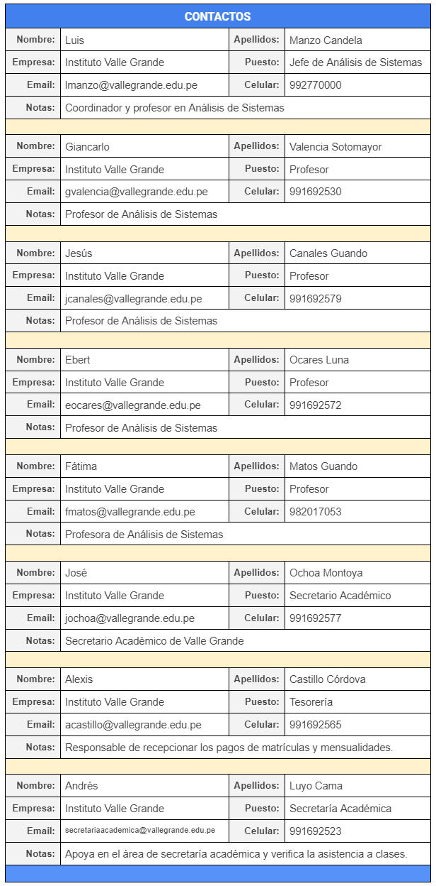

# Google Contacts

## Gestionando información de contactos
- Revisando nuestra agenda digital de contactos.
- Crear nuevo contacto a nuestra libreta de direcciones.
- Modificando datos de contacto.
- Eliminar contacto de la libreta de direcciones.
- Crear etiquetas para la organización de contactos.
- Importar lista de contactos a partir de un archivo ***csv***
- Exportar lista contactos en un archivo ***csv***
- Búsqueda de contactos en la libreta de direcciones
- Generar libreta de contactos en formato ***pdf***

## :orange_book: Recursos

- [Qué podemos hacer con Google Contacts](https://support.google.com/a/users/answer/9310345?hl=en)
- [Añadir, mover o importar contactos](https://support.google.com/contacts/answer/1069522?hl=es&ref_topic=9160153)
- [Editar o eliminar contactos](https://support.google.com/contacts/answer/7280886?hl=es&ref_topic=9160153)

## :bulb: Actividades

1. Crear los siguientes contactos en su libreta de direcciones:

2. 
